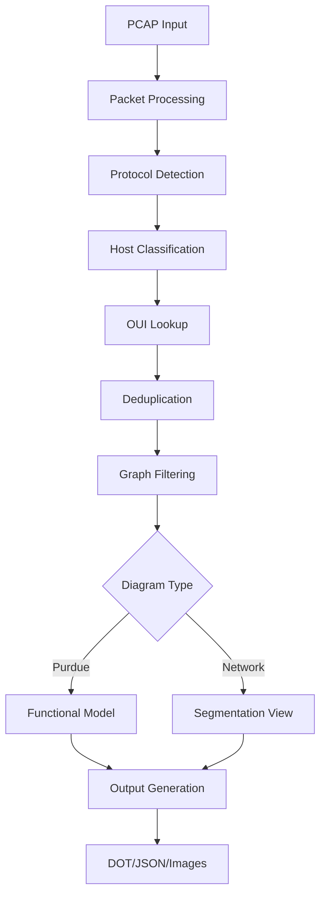

# Project Structure Documentation

This document provides an overview of the CIPgram project structure and architecture.

## 📁 Directory Structure

```
cipgram/
├── README.md                    # Main project documentation
├── main.go                      # Entry point and packet processing
├── types.go                     # Data structures and constants
├── protocols.go                 # Industrial protocol detection
├── classification.go            # Purdue level assignment logic
├── oui.go                      # MAC address/vendor identification  
├── writers.go                  # Diagram generation (DOT/JSON)
├── graph.go                    # Graph operations and deduplication
├── config.go                   # YAML configuration handling
├── go.mod                      # Go module dependencies
├── purdue_config.yaml          # Example configuration
├── test_cipgram.sh            # Test script
├── docs/                      # Detailed documentation
│   ├── ARCHITECTURE.md        # Technical architecture
│   ├── PROTOCOLS.md           # Protocol detection details
│   ├── CLASSIFICATION.md      # Purdue classification logic
│   └── [legacy docs]          # Historical documentation
└── diagrams/                  # Generated output directory
    └── [pcap_name]/
        ├── diagram.dot        # Graphviz source
        ├── diagram.png        # Generated images
        └── diagram.json       # Raw analysis data
```

## 🔧 Core Components

### **main.go** (339 lines)
- **Purpose**: Application entry point and packet processing loop
- **Key Functions**: 
  - Command line argument handling
  - PCAP/live capture management
  - Packet parsing and protocol detection
  - Host deduplication and analysis coordination
  - Output generation and caching

### **protocols.go** (182 lines)  
- **Purpose**: Industrial protocol identification
- **Key Functions**:
  - `protFromPacket()` - Main protocol detection
  - CIP service parsing for EtherNet/IP
  - Protocol disambiguation (Omron vs Mitsubishi, etc.)
  - Support for 20+ industrial protocols

### **classification.go** (297 lines)
- **Purpose**: Purdue Model level assignment
- **Key Functions**:
  - `tagHostHeuristic()` - Main classification logic
  - Protocol-based device role detection
  - Vendor-specific classification rules
  - Communication pattern analysis

### **oui.go** (411 lines)
- **Purpose**: MAC address vendor identification
- **Key Functions**:
  - Online OUI lookup with multiple sources
  - Local caching with persistence
  - Industrial vendor name standardization
  - Fallback mechanisms for offline operation

### **writers.go** (414 lines)
- **Purpose**: Diagram generation and output
- **Key Functions**:
  - `writePurdueDOT()` - Traditional Purdue diagrams
  - `writeNetworkDOT()` - Network segmentation diagrams
  - Asset label generation with full details
  - Network segment identification and visualization

### **graph.go** (275 lines)
- **Purpose**: Data structure management
- **Key Functions**:
  - Graph construction and manipulation
  - Host deduplication based on MAC addresses
  - Edge filtering and relationship analysis
  - Data merging for consolidated views

## 🎯 Data Flow



## 🏗️ Architecture Principles

### **Modular Design**
- **Single Responsibility**: Each file handles one major concern
- **Clear Interfaces**: Well-defined function signatures
- **Minimal Dependencies**: Each module operates independently

### **Performance Optimizations**
- **Streaming Processing**: Handles large PCAP files efficiently
- **Smart Caching**: OUI lookups cached locally
- **Concurrent Safe**: Thread-safe data structures
- **Memory Efficient**: Selective filtering reduces memory usage

### **Extensibility**
- **Protocol Addition**: Easy to add new protocol detection
- **Classification Rules**: Configurable heuristics
- **Output Formats**: Pluggable diagram generators
- **Data Sources**: Multiple OUI lookup sources

## 🔄 Key Algorithms

### **Protocol Detection**
1. **Port-based Initial Detection**: Check well-known industrial ports
2. **Payload Analysis**: Examine packet contents for protocol signatures
3. **Pattern Matching**: Use regex and heuristics for disambiguation
4. **Context Awareness**: Consider communication patterns

### **Purdue Classification**
1. **Protocol Analysis**: Examine initiated vs received traffic
2. **Peer Counting**: Analyze communication patterns
3. **Vendor Integration**: Use MAC address vendor information
4. **Role Assignment**: Map protocols to functional roles
5. **Level Inference**: Apply Purdue Model rules

### **Asset Deduplication**
1. **MAC Grouping**: Group hosts by MAC address
2. **Primary Selection**: Choose best host based on completeness
3. **Data Merging**: Combine protocol stats and metadata
4. **Edge Updating**: Redirect graph edges to primary hosts

## 📊 Output Generation

### **Purdue Diagrams**
- **Vertical Layout**: Traditional L3→L2→L1 hierarchy
- **Full Asset Details**: IP, MAC, vendor, role information
- **Protocol Flows**: Functional relationships between levels
- **Color Coding**: Level-based and vendor-based styling

### **Network Diagrams**  
- **Infrastructure Focus**: Routers, firewalls, network segments
- **Segmentation View**: CIDR-based network grouping
- **Key Assets**: Most important devices per segment
- **Planning Support**: Clear OT/IT boundaries

## 🧪 Testing Strategy

### **Unit Testing**
- Protocol detection accuracy
- Classification rule validation
- OUI lookup functionality
- Graph operations correctness

### **Integration Testing**
- End-to-end PCAP processing
- Multi-protocol capture analysis
- Output format validation
- Performance benchmarking

### **Test Data**
- Sample industrial PCAP files
- Known device configurations
- Protocol-specific captures
- Segmentation scenarios

## 🔮 Future Enhancements

### **Short Term**
- Additional protocol support (HART, Foundation Fieldbus)
- Enhanced CIP service decoding
- Improved network topology detection
- Real-time monitoring capabilities

### **Long Term**
- Machine learning classification
- Threat detection integration
- Historical trend analysis
- Integration with SIEM systems

---

This modular architecture ensures CIPgram remains maintainable, extensible, and performant while handling the complexities of industrial network analysis.
